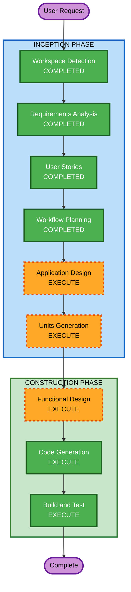

# Execution Plan

## Detailed Analysis Summary

### Change Impact Assessment
- **User-facing changes**: Yes — 소매처용 공구 탐색/참여 화면, 어드민 관리 화면
- **Structural changes**: Yes — 신규 프로젝트 전체 구조 설계
- **Data model changes**: Yes — GroupBuy, Participation, AdminUser 엔티티
- **API changes**: Yes — REST API 전체 신규 설계 (어드민 8개, 유저 5개, 공통 1개)
- **NFR impact**: Low — 로컬 데모용, 보안/성능 요구 최소

### Risk Assessment
- **Risk Level**: Low (신규 프로젝트, 로컬 환경, 데모 목적)
- **Rollback Complexity**: Easy (운영 배포 없음)
- **Testing Complexity**: Moderate (동시성 처리, 상태 머신 검증 필요)

---

## Workflow Visualization



### Text Alternative
```
Phase 1: INCEPTION
- Workspace Detection (COMPLETED)
- Requirements Analysis (COMPLETED)
- User Stories (COMPLETED)
- Workflow Planning (COMPLETED)
- Application Design (EXECUTE)
- Units Generation (EXECUTE)

Phase 2: CONSTRUCTION
- Functional Design (EXECUTE)
- NFR Requirements (SKIP)
- NFR Design (SKIP)
- Infrastructure Design (SKIP)
- Code Generation (EXECUTE)
- Build and Test (EXECUTE)
```

---

## Phases to Execute

### INCEPTION PHASE
- [x] Workspace Detection (COMPLETED)
- [x] Reverse Engineering (SKIPPED — Greenfield)
- [x] Requirements Analysis (COMPLETED)
- [x] User Stories (COMPLETED)
- [x] Workflow Planning (IN PROGRESS)
- [ ] Application Design — **EXECUTE**
  - **Rationale**: 신규 프로젝트로 컴포넌트 식별, 서비스 레이어 설계, 컴포넌트 간 의존 관계 정의 필요
- [ ] Units Generation — **EXECUTE**
  - **Rationale**: 백엔드 + 어드민 프론트 + 유저 프론트 3개 모듈로 분리, 구현 순서와 의존성 정의 필요

### CONSTRUCTION PHASE
- [ ] Functional Design — **EXECUTE**
  - **Rationale**: 상태 머신(GroupBuy 라이프사이클), 동시성 처리, 마감 자동 로직 등 비즈니스 규칙 상세 설계 필요
- [ ] NFR Requirements — **SKIP**
  - **Rationale**: 로컬 데모 프로젝트, Security Extension 미적용, 성능/확장성 요구 최소
- [ ] NFR Design — **SKIP**
  - **Rationale**: NFR Requirements 건너뜀
- [ ] Infrastructure Design — **SKIP**
  - **Rationale**: 로컬 개발 환경 전용, 클라우드 인프라 배포 없음
- [ ] Code Generation — **EXECUTE** (ALWAYS)
  - **Rationale**: 구현 계획 수립 및 코드 생성 필수
- [ ] Build and Test — **EXECUTE** (ALWAYS)
  - **Rationale**: 빌드 지침 및 테스트 계획 생성 필수

### OPERATIONS PHASE
- [ ] Operations — PLACEHOLDER

---

## Execution Summary

| 단계 | 상태 | 이유 |
|------|------|------|
| Application Design | EXECUTE | 컴포넌트/서비스 설계 필요 |
| Units Generation | EXECUTE | 멀티 모듈 분리 및 순서 정의 |
| Functional Design | EXECUTE | 상태 머신, 동시성, 비즈니스 규칙 설계 |
| NFR Requirements | SKIP | 데모용, 최소 NFR |
| NFR Design | SKIP | NFR Requirements 건너뜀 |
| Infrastructure Design | SKIP | 로컬 전용 |
| Code Generation | EXECUTE | 필수 |
| Build and Test | EXECUTE | 필수 |

**총 실행 단계**: 5개 (Application Design → Units Generation → Functional Design → Code Generation → Build and Test)
**건너뛸 단계**: 3개 (NFR Requirements, NFR Design, Infrastructure Design)

---

## Success Criteria
- **Primary Goal**: 마켓뱅 공동구매 v2 MVP 데모 서비스 완성 (로컬 실행 가능)
- **Key Deliverables**:
  - Spring Boot 3 백엔드 API 서버
  - Vue 3 + CoreUI 어드민 프론트엔드
  - Vue 3 + Vite 유저 프론트엔드
  - MySQL DDL 스크립트
- **Quality Gates**:
  - 어드민에서 공구 등록 → 유저 페이지 즉시 확인
  - 유저 참여 → 실시간 참여 현황 반영
  - 목표 달성/미달 시 자동 확정/취소
